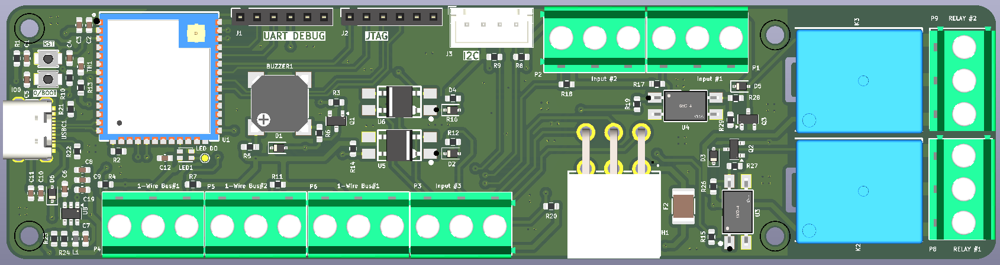
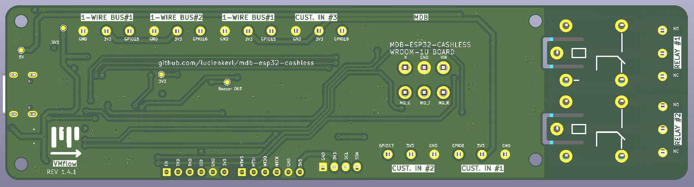

# MDB ESP32 Cashless Devices

This repository contains open hardware projects for MDB-based cashless devices built around the ESP32 platform.

## PCBWay Project Store
You can view and order the PCBs directly from PCBWay using the links below:

👉 MDB ESP32-S3-WROOM-1U board: https://www.pcbway.com/project/shareproject/MDB_Slave_ESP32_S3_WROOM_1U_4_layer_cashless_telemetry_board_for_vending_mac_cb2e3ef8.html

👉 Other boards: https://www.pcbway.com/project/member/?bmbno=1B3B95CB-4E28-4D

---

### MDB ESP32-S3-WROOM-1U Cashless Device

4-layer board with external antenna, relays and sensor I/O — see [`mdb_slave_esp32s3-wroom-1u/`](mdb_slave_esp32s3-wroom-1u/) for sources, gerbers and the interactive BOM.

### MDB ESP32 Cashless Device

### MDB ESP32 GPS/LTE-M/NB-IoT Cashless Device
